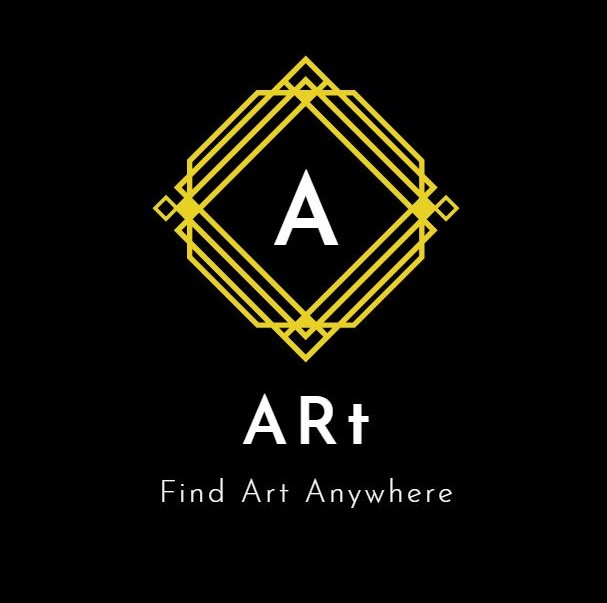

## Welcome to ARt 

### What is our product?

Our product is an AR app that focuses on helping digital artist bring their creations to the physical world. Much like how Pokemon GO has shown that AR technology can pioneer new ways we explore our cities, our app will let users explore a community of artists sharing their creations in the real world. Our product is an augmented reality platform which allows users to share their drawings at real locations for other users to see.

### Features implemented for MVP 1
1. AR Object placement
  Currently, the placement of the AR object does not offer simultaneous horizontal and vertical placement. The user can only choose from    the start to either use horizontal or vertical placement.
2. Basic UI implementation
  Includes a Main Menu: An interface where the user can start the app or quit it. Options are not implemented yet. Account and art          uploading is still not available.
3. Prompt user placement: Asks the user if the image will be placed horizontally or vertically. Basically, if the image will be place on    a “floor” or on a “wall” 
    Android build support

### About Us

Matthew researched and convey the AR Core library features to Jackie and Miguel. He wrote the prototype scripts that were used for the AR demo. The functionality of the scripts include plane detection, image to anchor adjustment, and vertical or horizontal plane detect. 

Jackie was responsible for creating a UI and setting up buttons for the application. He acted as the middle man for communication between UI and AR development, and helped to revise scripts created by Matthew. 

Miguel aided in the development problems that arose while creating the UI. He also took part in the research of which AR library to use for development, and was reaching out to customers on both tempe and west campus.

Kenny reached out to potential customers through surveys and tried to get feedback. He also met with customers on polytechnic campus, as we were unable to go there due to time constraints.

We will provide an AR application which will allow for customizable picture placement in the real world through Augmented Reality. This is our first Android app which will be beta tested in the Google Play Store. We formed this product in order to explore the possibilities of what could be done with current AR technology. ARcore is Google's solution to making AR accessible to everyone through your android phone. Our product will be powered by Google's ARcore Engine.

We have completed our MVP-1 and will launch our MVP-2 with features such as custom image selection.

### Contact Us

Direct email to one of our engineers.
mdpham@asu.edu

[]
