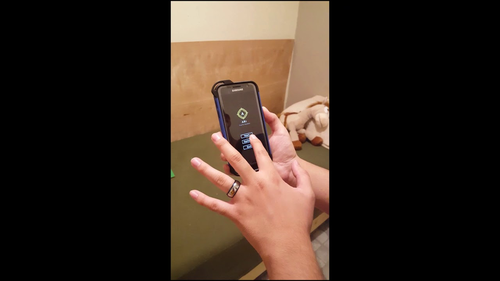
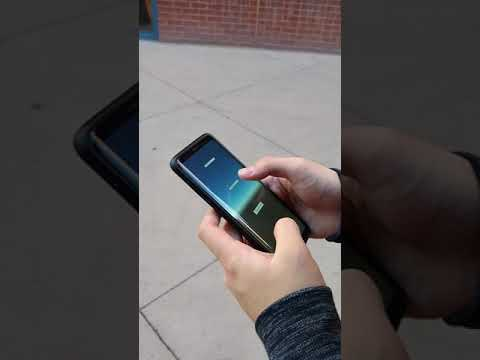
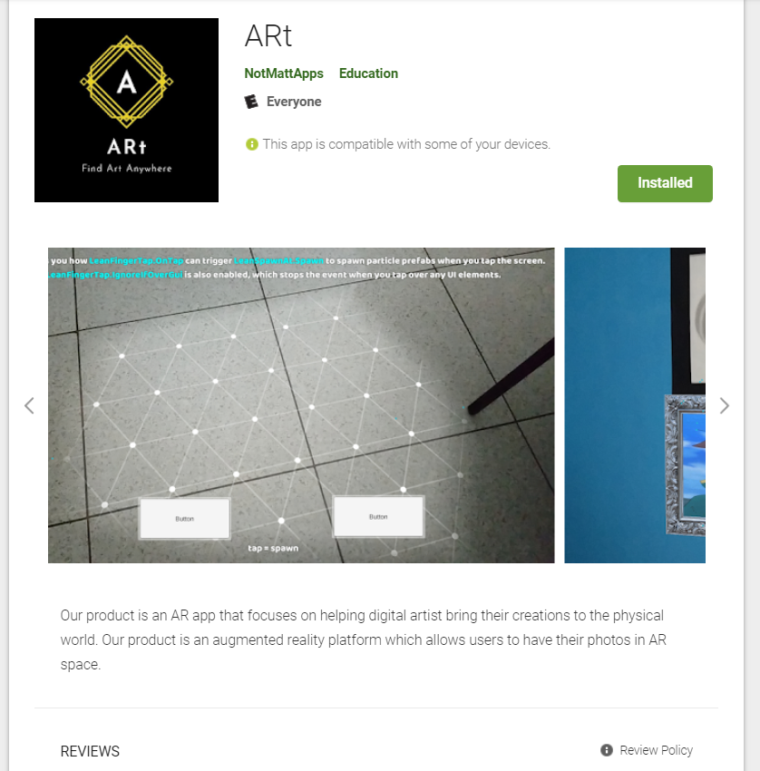
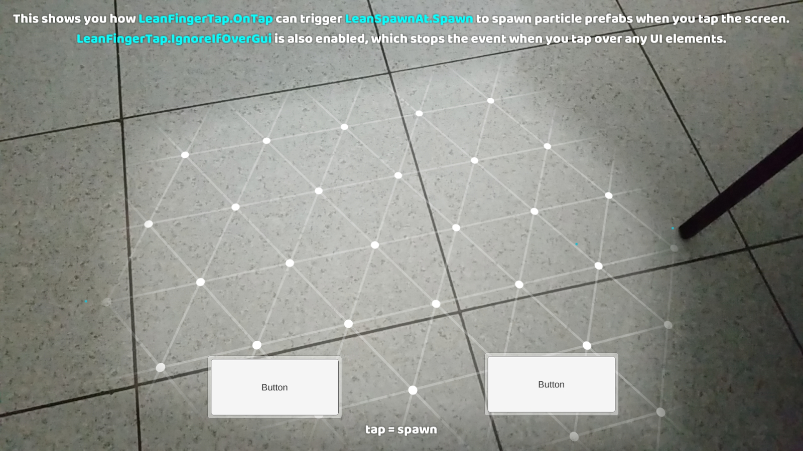
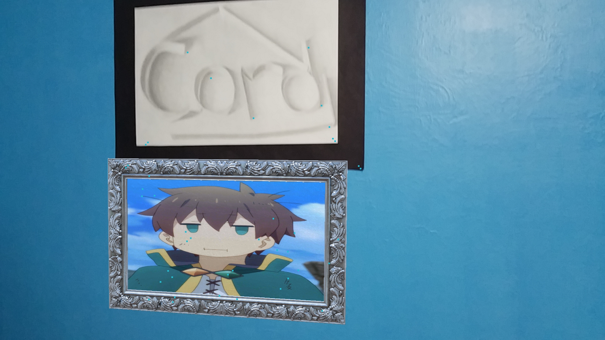
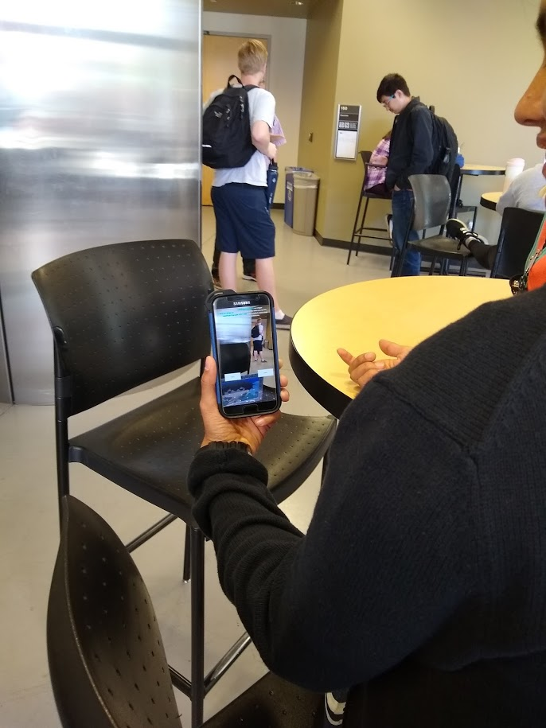

## Welcome to ARt 

[Contact](### Contact Us)

This is a link to our application to the [Google Play Store](https://play.google.com/store/apps/details?id=com.NotMatt.ARt)

### What is our product?

Our product is an AR app that focuses on helping digital artist bring their creations to the physical world. Much like how Pokemon GO has shown that AR technology can pioneer new ways we explore our cities, our app will let users explore a community of artists sharing their creations in the real world. Our product is an augmented reality platform which allows users to share their drawings at real locations for other users to see.

### FAQ 

#### Does this app support my phone?

* Phones with ARcore support can be listed here. https://developers.google.com/ar/discover/supported-devices
* If your phone is not supported, the app will not work for you.

#### What Features have been implemented for MVP 1

* AR Object placement 
Currently, the placement of the AR object does not offer simultaneous horizontal and vertical placement. The user can only choose from the start to either use horizontal or vertical placement.
* Basic UI implementation 
Includes a Main Menu: An interface where the user can start the app or quit it. Options are not implemented yet. Account and art uploading is still not available.
* Prompt user placement: 
Asks the user if the image will be placed horizontally or vertically. Basically, if the image will be place on  a “floor” or on a “wall” Android build support

#### What Features have been implemented for MVP 2

*  Firebase authentication 
Allows users to register and sign in with Google Firebase.  
* Custom Image selection
Allow users to upload their images from their phone gallery to the selected image.

#### Other Possible Features

* Stability and bug fixes for AR engine.

### About Us
We have recently launched the AR application to the Google Play Store. 

Matthew researched and convey the AR Core library features to Jackie and Miguel. He wrote the prototype scripts that were used for the AR demo. The functionality of the scripts include plane detection, image to anchor adjustment, and vertical or horizontal plane detect. 

Jackie was responsible for creating a UI and setting up buttons for the application. He acted as the middle man for communication between UI and AR development, and helped to revise scripts created by Matthew. 

Miguel aided in the development problems that arose while creating the UI. He also took part in the research of which AR library to use for development, and was reaching out to customers on both tempe and west campus.

Kenny reached out to potential customers through surveys and tried to get feedback. He also met with customers on polytechnic campus, as we were unable to go there due to time constraints.

Our team will provide an AR application which will allow for customizable picture placement in the real world through Augmented Reality. This is our first Android app which will be avaliable in the Google Play Store. We formed this product in order to explore the possibilities of what could be done with current AR technology. ARcore is Google's solution to making AR accessible to everyone through your android phone. Our product will be powered by Google's ARcore Engine. Our product is built off of the Unity Engine.

We wanted a way for people to see their uploaded digital artwork in the real world. See the contact us section to get in contact with a team member.

We have completed our MVP-1 and will launch our MVP-2 with features such as custom image selection and user login.

### Product/Services
This shows off some of our application features.

This is our basic MVP 1 with the core AR placement feature.

This is our MVP 2 with login and custom image selection.

This is a link to our application to the [Google Play Store](https://play.google.com/store/apps/details?id=com.NotMatt.ARt)

An example of what the plane detect would look like through the AR interface. A grid of points will appear and tapping will let the user place the object.

An example of an AR object appearing through the phone’s screen, and how it fits into the background as if it were real.

Someone placing an object indoors.

### Contact Us

If you would like to get in touch with us, please use the email for one of our engineers at mdpham@asu.edu

[Or you can fill at this contact form](https://applicationart.github.io/contact)

